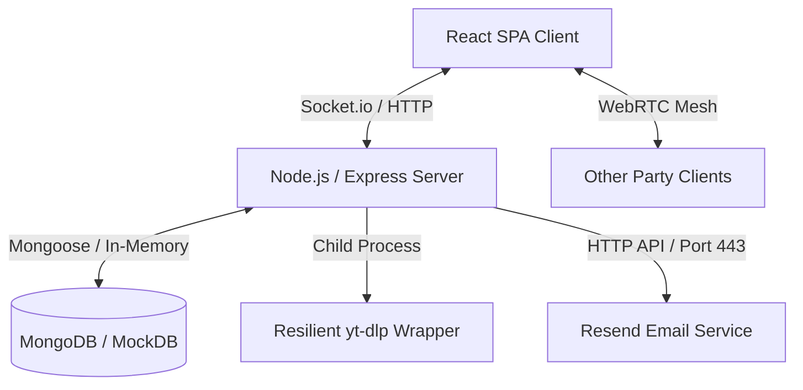
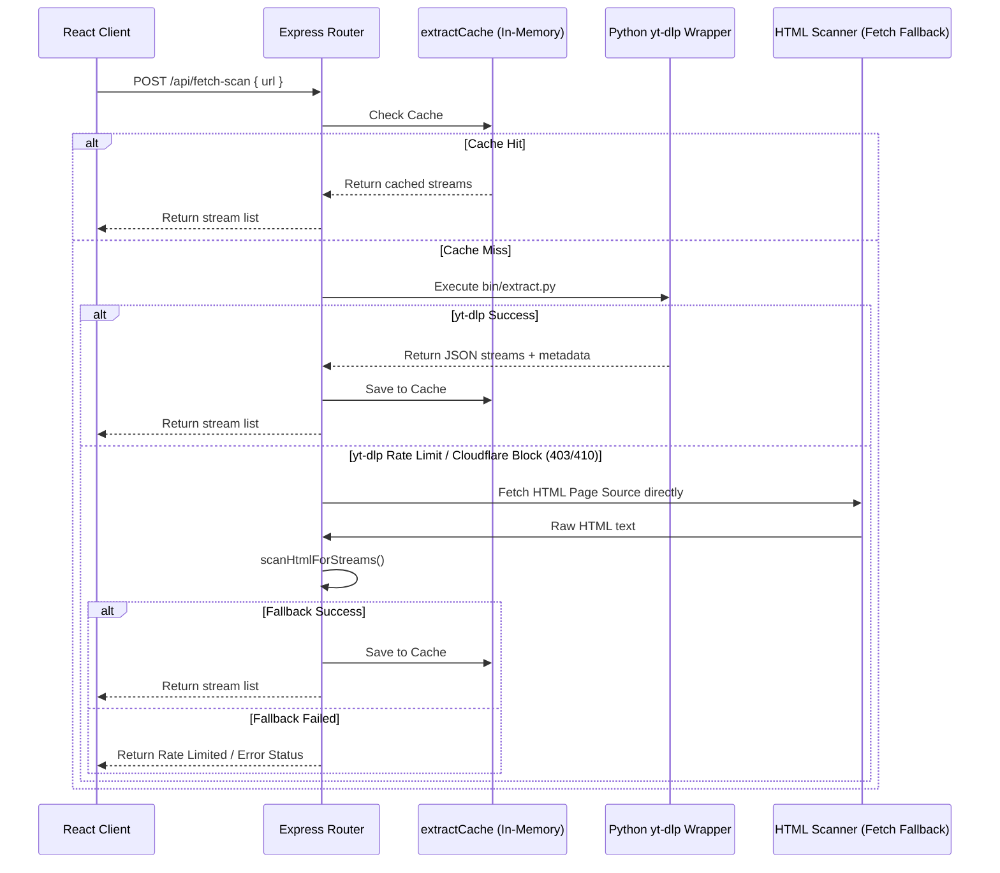
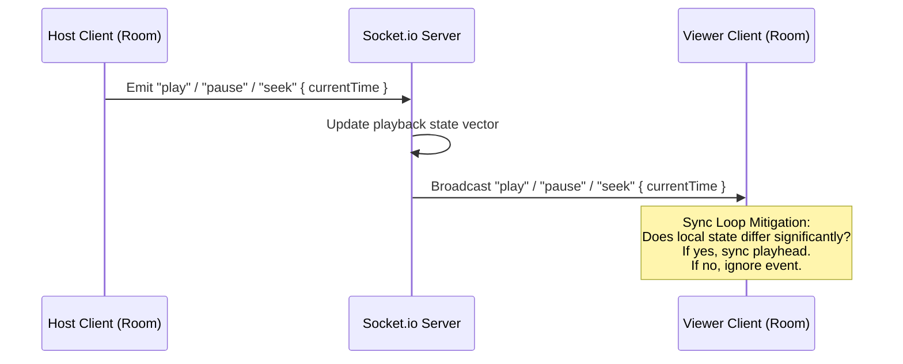
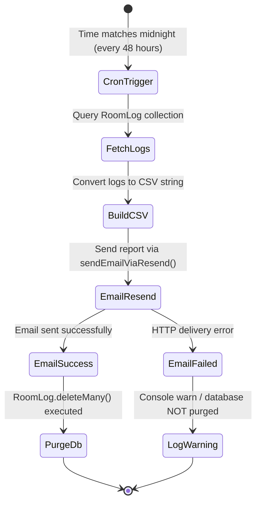

# Watch Stream - Technical Architecture Blueprint

This document serves as the master technical blueprint and architectural specification for the **Watch Stream** application. It details the system components, data flows, core mechanisms, and security features implemented across the codebase.

---

## 1. System Architecture Overview

Watch Stream is designed as a decoupled, real-time collaborative web application. It consists of a React Single Page Application (SPA) frontend, an Express-based Node.js backend, a WebSockets event broker, and a dual-tier MongoDB storage system.



### Technical Stack & Component Interactions

1. **Frontend SPA (Vite + React)**:
   - Configured with a responsive, mobile-first design system utilizing vanilla CSS variables for dynamic theming (Dark/Light mode).
   - Manages state reactively using React Hooks (`useState`, `useEffect`, `useRef`).
   - Uses WebRTC APIs for mesh voice communication and native tab/screen sharing.
   - Integrates Service Workers via `vite-plugin-pwa` for standalone installability and native OS integration.

2. **Backend Server (Node.js + Express)**:
   - Serves static SPA client assets from the production bundle `dist/`.
   - Mounts REST API routes for room setup, stream extraction, media proxying, admin auditing, and log exports.
   - Operates a Socket.io WebSocket server on the same HTTP port to manage bidirectional, low-latency room updates.

3. **Socket.io WebSockets Broker**:
   - Manages connections under namespaces and rooms.
   - Handles room join approvals, role assignments (`host`, `admin`, `viewer`), latency-compensated time synchronization, chat dispatch, and emoji broadcast events.

4. **Dual-Tier Database Persistence (`db.js`)**:
   - **Mongoose / MongoDB Layer**: If a valid `MONGO_URI` is provided, Mongoose compiles schemas for Room Logs (`RoomLog`) and IP Bans (`IpBan`) with TTL indexes for automated records expiration.
   - **In-Memory Fallback Layer**: If the remote MongoDB Atlas cluster is offline or authorization fails, the database gracefully downgrades to local Javascript Classes (`MockRoomLogModel` and `MockIpBanModel`). This guarantees zero downtime and a plug-and-play development environment.

---

## 2. Core Bypass & Extraction Engine

The application features a robust stream extraction pipeline that pulls direct media URLs from diverse streaming and social sites, bypassing CORS and IP rate-limiting blocks.



### A. Resilient yt-dlp Wrapper (`bin/extract.py`)
- Executes `yt-dlp` in a Python child process to extract stream URLs and video metadata (titles, durations, and thumbnails).
- **Monkey-Patching Parser**: Standard `yt-dlp` script throws fatal `ExtractorError` exceptions if it cannot extract specific metadata items (such as the title). To prevent extraction failure on minor HTML markup changes, `bin/extract.py` patches `InfoExtractor._search_regex` dynamically to turn metadata extraction failures into non-blocking, soft fallbacks:
  ```python
  # Monkey-patch info extractor to make metadata extraction warnings soft
  _orig_search_regex = InfoExtractor._search_regex
  def _patched_search_regex(self, pattern, string, name, *args, **kwargs):
      try:
          return _orig_search_regex(self, pattern, string, name, *args, **kwargs)
      except ExtractorError:
          soft_fields = ("title", "uploader", "description", "thumbnail", "duration")
          if any(s in str(name).lower() for s in soft_fields):
              kwargs.pop("default", None)
              return kwargs.get("default") if "default" in kwargs else None
          raise
  ```
- **Bypass Configuration**: Passes standard browser HTTP request headers (User-Agent, Referer, Accept-Language, Accept-Encoding) and sets age limit overrides (`age_limit: 99`) to bypass basic anti-bot blockers.

### B. Smart Fallback HTML Scanner
- If `yt-dlp` is rate-limited or fails with Cloudflare verification errors (e.g. HTTP 410, 403, "Gone"), the Express route triggers a fallback HTTP request using standard Node `fetch` to load the target page directly.
- The raw HTML payload is run through a local parser `scanHtmlForStreams(html)` which extracts video sources (e.g. `.mp4`, `.m3u8`, `.mpd`) and iframe targets embedded in the document, ensuring extraction works even when `yt-dlp` scripts are blocked.

### C. Absolute Cache Unification (`extractCache`)
- Extracted streams are cached in an in-memory `Map` keyed by the exact sanitized target URL.
- This cache prevents redundant network traffic and minimizes extraction request rates, protecting the server's IP address from CDN bans.

### D. HLS Proxy Rewrite Pipeline (`/api/hls-proxy`)
- Media playlists (such as `.m3u8` variant streams) use relative paths for transport fragments (`.ts` chunks). Standard browser media players fail to fetch these segments due to CORS headers or missing origin credentials.
- The proxy endpoint intercepts requests, validating security (resolves IP addresses and blocks private IP ranges via `isPrivateIp` to prevent SSRF attacks) and matches session headers using token lookups (`proxySessions`).
- When fetching a `.m3u8` playlist, the server rewrites all relative chunk paths to point back through the HLS proxy recursively:
  ```javascript
  // Rewrites lines containing relative media URLs inside .m3u8 files
  function rewriteM3u8(playlistText, baseUrl, proxyPath, referer, token) {
    return playlistText.split("\n").map(line => {
      const trimmed = line.trim();
      if (!trimmed || trimmed.startsWith("#")) return line;
      const absoluteUrl = resolveUrl(trimmed, baseUrl);
      return `${proxyPath}?b64=${base64Encode(absoluteUrl)}&ref=${base64Encode(referer)}&ptk=${token}`;
    }).join("\n");
  }
  ```
- Supports HTTP Range Requests (HTTP 206) for video fragment streaming, allowing smooth, fast seeks inside standard HTML5 video elements.

---

## 3. Real-Time Synchronization Logic

To deliver a synchronized watching experience, the server maintains the room's playback state and broadcasts updates to all active clients.



### A. Playback State Vector
Each room has an active state vector stored in memory on the server:
```json
{
  "source": "https://server.com/api/hls-proxy?b64=...",
  "sourceType": "hls",
  "title": "Movie Title",
  "currentTime": 128.45,
  "isPlaying": true,
  "lastUpdated": 1717600800000,
  "hostSocketId": "socket_id_abc"
}
```

### B. Latency Compensation (Time Projection)
When a new participant joins the room, the server projects the estimated current playback position before sending the state:
$$\text{Projected Time} = \text{currentTime} + \frac{\text{Date.now()} - \text{lastUpdated}}{1000}$$
If the video was paused when updated, the projection delta is ignored. This ensures users connect at the correct time index regardless of network connection delays.

### C. Sync Feedback Loop Mitigation
A primary challenge of real-time sync is preventing "infinite feedback loops" (where a client seek triggers a socket event, which updates the server, which broadcasts back to the client, causing another seek).
- **Significance Gate**: The React client's local player updates its time index only if the incoming server playhead position differs from the local position by more than $2.0$ seconds:
  ```javascript
  const timeDiff = Math.abs(player.getCurrentTime() - data.currentTime);
  if (timeDiff > 2.0) {
    player.seekTo(data.currentTime);
  }
  ```
- **Origin Check**: Standard controls (`play`, `pause`, `seek`) are only emitted to the socket if triggered directly by user interaction. Internal state changes triggered programmatically by incoming socket events are flagged to skip sending socket updates back.

### D. Floating Emoji Reactions
- **Event Flow**: When a participant clicks an emoji button in the UI, the frontend emits a `reaction` event: `socket.emit("reaction", { emoji: "🔥" })`.
- **Broadcast**: The server broadcasts this event immediately to all participants in the room.
- **Rendering & Animation**: On receiving `reaction`, the frontend creates a temporary object in `floatingReactions` state with a random horizontal coordinate.
- **CSS Lifecycle**: The emoji is rendered inside a relative wrapper over the video player. It uses CSS `@keyframes float-up` to drift upwards, scale, and fade out over $2.8$ seconds. A React `setTimeout` garbage-collects the state element after $3.0$ seconds to keep memory usage low.

---

## 4. Frontend & Mobile UX (PWA)

### A. Progressive Web App (PWA) Configuration
- Managed via `vite-plugin-pwa` in `vite.config.js`.
- Configures an automated Service Worker (`registerType: 'autoUpdate'`) which caches the static assets (`index.html`, JS chunks, CSS bundles, assets) for offline and fast-load support.
- Contains metadata definitions, theme variables, and responsive layout markers for mobile displays.

### B. Web Share Target API
- The PWA manifest registers a custom `share_target` handler:
  ```json
  "share_target": {
    "action": "/watch-party/",
    "method": "GET",
    "params": {
      "title": "title",
      "text": "text",
      "url": "shared_url"
    }
  }
  ```
- This configures the application to appear in the native "Share Sheet" of mobile operating systems (iOS and Android). When a user shares a video link from apps like YouTube, TikTok, or Safari, the OS opens Watch Stream and appends the URL as a query parameter.
- **Query Interceptor**: Inside `Room.jsx`, a React hook intercepts the query parameters, extracts the URL, pre-fills the input field, and clears the browser history state to prevent duplicate loads:
  ```javascript
  useEffect(() => {
    const params = new URLSearchParams(window.location.search);
    const sharedUrl = params.get('shared_url') || params.get('text');
    if (sharedUrl) {
      const urlMatch = sharedUrl.match(/https?:\/\/[^\s]+/);
      if (urlMatch) {
        setSourceInput(urlMatch[0]);
        window.history.replaceState(null, '', window.location.pathname);
      }
    }
  }, []);
  ```

### C. Playback Memory Leak Prevention
- Multi-protocol players (such as HLS, Dash, WebRTC streams) can easily cause memory leaks or CPU utilization issues if not disposed of correctly.
- The `VideoPlayer.jsx` component implements strict unmount teardowns:
  - Destroys active WebRTC connections (`RTCPeerConnection`).
  - Calls `.destroy()` or `.close()` on active HLS.js or Dash.js player instances.
  - Releases camera, screen, and mic media streams (`mediaStream.getTracks().forEach(t => t.stop())`).
  - Closes testing oscillators and global `AudioContext` structures.

### D. Quality Selector Thumbnail Preview
- When video streams are extracted, the JSON response includes metadata fields (`title` and `thumbnail`).
- The quality picker overlay parses this metadata and displays a preview card with a cover image and title at the top of the stream list. An `onError` handler is configured on the preview image to hide the image element if the source URL fails to load.

---

## 5. Admin & Maintenance Systems

### A. Resend HTTP API Email System (`sendEmailViaResend`)
- **Problem**: Render's network configuration blocks all outbound SMTP connections (ports 25, 465, and 587) to prevent spam abuse. This caused traditional SMTP clients (like Nodemailer) to timeout.
- **Solution**: The application uses the **Resend HTTP REST API** over Port 443 (standard HTTPS). Emails are dispatched via a custom JSON payload sent using native `fetch`:
  ```javascript
  const response = await fetch("https://api.resend.com/emails", {
    method: "POST",
    headers: {
      "Authorization": `Bearer ${process.env.RESEND_API_KEY}`,
      "Content-Type": "application/json"
    },
    body: JSON.stringify({
      from: "onboarding@resend.dev",
      to: [receiverEmail],
      subject: subject,
      text: text,
      attachments: attachments // Supporting Base64 encoded file attachments
    })
  });
  ```

### B. Automated Maintenance Cron Jobs
Using `node-cron`, the server schedules maintenance routines to clean databases and report usage metrics.



1. **48-Hour Database Purge**:
   - Runs every 48 hours at midnight: `cron.schedule('0 0 */2 * *')`.
   - **Data Safety Gate**: Before deleting log history, the system retrieves all stored log records, compiles them into a CSV file, and emails the report using the Resend helper.
   - Deletion (`RoomLog.deleteMany`) is only executed if the email API returns a success status. If delivery fails, the logs are kept to prevent data loss.

2. **Bi-Daily Status Reports**:
   - Runs every 12 hours: `cron.schedule('0 */12 * * *')`.
   - Compiles server status indicators (active rooms count, connected participants count, system CPU/memory load) and sends a report to the administrator.
